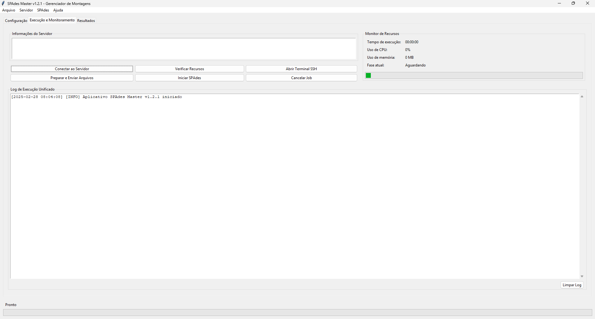

# SPAdes Master

SPAdes Master é uma interface gráfica em Python para gerenciar, executar e monitorar montagens genômicas utilizando o [SPAdes](https://github.com/ablab/spades) (St. Petersburg genome assembler) em servidores remotos.



## Visão Geral

SPAdes Master facilita o fluxo de trabalho de montagem genômica, proporcionando uma interface amigável para gerenciar todas as etapas do processo, desde a conexão ao servidor até a recuperação dos resultados. É especialmente útil para bioinformáticos e pesquisadores que precisam executar montagens de genoma em servidores remotos de alto desempenho.

### Funcionalidades Principais

- **Gerenciamento de perfis de servidor**: salve e gerencie múltiplas configurações de servidores
- **Conexão SSH simplificada**: conecte-se facilmente a servidores remotos sem precisar usar comandos de terminal
- **Envio automático de arquivos**: envie seus arquivos FASTQ para o servidor com apenas alguns cliques
- **Configuração personalizada do SPAdes**: configure todos os parâmetros importantes do SPAdes através da interface gráfica
- **Monitoramento em tempo real**: acompanhe o progresso e uso de recursos durante a execução
- **Download de resultados**: baixe os resultados da montagem automaticamente quando concluídos
- **Visualização integrada**: visualize e analise os resultados básicos da montagem

## Requisitos

- Python 3.6 ou superior
- Bibliotecas Python (instaladas automaticamente via pip):
  - tkinter
  - paramiko
  - scp
- SPAdes instalado no servidor remoto

## Instalação

### Método 1: A partir do repositório

```bash
# Clonar o repositório
git clone https://github.com/seu-usuario/spades-master.git
cd spades-master

# Criar ambiente virtual (opcional, mas recomendado)
python -m venv venv
source venv/bin/activate  # No Windows: venv\Scripts\activate

# Instalar dependências
pip install -r requirements.txt
```

### Método 2: Pacote PyPI

```bash
# Instalar diretamente via pip
pip install spades-master
```

## Estrutura do Projeto

```
spades-master/
├── config/
│   ├── __init__.py
│   └── settings.py          # Configurações globais da aplicação
├── media/                   # Recursos de mídia (ícones, imagens)
├── models/
│   ├── __init__.py
│   └── server_profile.py    # Modelo para gerenciar perfis de servidor
├── services/
│   ├── __init__.py
│   └── job_manager.py       # Gerencia trabalhos remotos SSH
├── ui/
│   ├── __init__.py
│   ├── app.py               # Aplicação principal
│   ├── frames/              # Frames da interface gráfica
│   │   ├── config_frame.py
│   │   ├── execution_frame.py
│   │   ├── monitoring_frame.py
│   │   └── results_frame.py
│   └── dialogs/             # Diálogos da interface
│       ├── params_dialog.py
│       ├── profile_dialog.py
│       └── spades_path_dialog.py
├── utils/
│   ├── __init__.py
│   ├── logging_utils.py     # Utilitários de log
│   ├── ssh_utils.py         # Utilitários SSH
│   └── status_updater.py    # Atualização de status na interface
├── main.py                  # Ponto de entrada da aplicação
├── requirements.txt         # Dependências do projeto
└── README.md                # Este arquivo
```

## Como Usar

### Executar a aplicação

```bash
# A partir do diretório do projeto
python main.py

# OU, se instalado via pip
spades-master
```

### Configurando um Perfil de Servidor

1. Inicie o aplicativo
2. Clique em "Novo" no campo de perfil ou no menu "Servidor" > "Gerenciar Perfis"
3. Preencha os detalhes do servidor:
   - Nome do perfil (para referência)
   - Endereço do servidor (IP ou nome de domínio)
   - Porta SSH (geralmente 22)
   - Nome de usuário
   - Método de autenticação (senha ou chave SSH)
4. Clique em "Salvar"

### Executando uma Montagem

1. Selecione um perfil de servidor na aba "Configuração"
2. Clique em "Selecionar Arquivos R1/R2" para escolher seus arquivos FASTQ
3. Configure os parâmetros do SPAdes:
   - Threads (número de núcleos a utilizar)
   - Memória (GB)
   - Modo de montagem (isolate, careful, meta, etc.)
   - K-mers (opcional)
4. Na aba "Execução e Monitoramento", clique em "Conectar ao Servidor"
5. Após a conexão, clique em "Preparar e Enviar Arquivos"
6. Quando os arquivos forem enviados, clique em "Iniciar SPAdes"
7. Monitore o progresso na aba "Monitor de Recursos"

### Baixando Resultados

1. Quando a montagem estiver concluída, vá para a aba "Resultados"
2. Clique em "Baixar Resultados"
3. Os arquivos serão baixados para o diretório local especificado
4. Clique em "Abrir Pasta de Resultados" para visualizar os arquivos

## Características Detalhadas

### Gerenciamento de Perfis de Servidor

O SPAdes Master permite salvar múltiplos perfis de servidor, facilitando a conexão a diferentes máquinas sem precisar inserir as credenciais repetidamente. Os perfis são armazenados localmente e podem ser facilmente gerenciados através da interface.

### Monitoramento de Recursos

Durante a execução do SPAdes, a aplicação monitora:
- Uso de CPU
- Uso de memória
- Tempo decorrido
- Fase atual da montagem

### Autenticação Segura

Suporta dois métodos de autenticação:
- **Senha**: Autenticação padrão com usuário e senha
- **Chave SSH**: Autenticação mais segura usando par de chaves pública/privada

### Terminal SSH Integrado

Possibilidade de abrir um terminal SSH diretamente do aplicativo para interagir manualmente com o servidor quando necessário.

### Configuração Avançada do SPAdes

A interface permite configurar parâmetros avançados do SPAdes, incluindo:
- Diferentes modos de montagem (isolate, careful, meta, rna, plasmid, etc.)
- Valores de k-mer personalizados
- Alocação de recursos (threads e memória)
- Parâmetros específicos como cutoff de cobertura e offset de qualidade Phred

## Solução de Problemas

### O SPAdes não é encontrado automaticamente

Se o SPAdes não for encontrado automaticamente no servidor:
1. Um diálogo será exibido pedindo para especificar o caminho manualmente
2. Você pode selecionar entre caminhos comuns ou inserir um caminho personalizado
3. O aplicativo verificará se o caminho fornecido é válido

### Problemas de Conexão SSH

Se ocorrerem problemas de conexão SSH:
1. Verifique se o servidor está acessível (ping)
2. Confirme se as credenciais estão corretas
3. Verifique restrições de firewall
4. Teste a conexão SSH manualmente no terminal

### Erros na Execução do SPAdes

Se o SPAdes falhar durante a execução:
1. Verifique os logs na interface
2. Confirme se o SPAdes está instalado corretamente no servidor
3. Verifique se há memória e espaço em disco suficientes
4. Tente reduzir o número de threads ou a quantidade de memória alocada

## Gerando uma Distribuição Executável

Para criar um executável independente do SPAdes Master:

### Windows (usando PyInstaller)

```bash
# Instalar PyInstaller
pip install pyinstaller

# Gerar executável
pyinstaller --name="SPAdesMaster" --windowed --icon=media/spades_icon.ico --add-data="media;media" main.py
```

### macOS (usando PyInstaller)

```bash
# Instalar PyInstaller
pip install pyinstaller

# Gerar aplicativo
pyinstaller --name="SPAdesMaster" --windowed --icon=media/spades_icon.icns --add-data="media:media" main.py
```

### Linux (usando PyInstaller)

```bash
# Instalar PyInstaller
pip install pyinstaller

# Gerar aplicativo para Linux
pyinstaller --name="SPAdesMaster" --windowed --icon=media/spades_icon.ico-add-data="media:media" main.py
```

O executável resultante será encontrado na pasta `dist`.

## Contribuindo

Contribuições são bem-vindas! Por favor, sinta-se à vontade para abrir issues ou enviar pull requests.

1. Faça fork do repositório
2. Crie sua branch de feature (`git checkout -b feature/sua-feature`)
3. Faça commit das suas mudanças (`git commit -m 'Adiciona alguma feature'`)
4. Faça push para a branch (`git push origin feature/sua-feature`)
5. Abra um Pull Request

## Licença

Este projeto está licenciado sob a licença MIT - veja o arquivo LICENSE para detalhes.

## Créditos

- SPAdes Master é desenvolvido e mantido por [Seu Nome/Organização]
- [SPAdes](https://github.com/ablab/spades) - St. Petersburg genome assembler

## Citação

Se você usar o SPAdes Master em sua pesquisa, por favor cite:

```
Lucas Giovanella, et al. (2025). SPAdes Master: A graphical interface for SPAdes genome assembler. [URL do Repositório]
```

E não se esqueça de citar também o SPAdes:

```
Bankevich, A., et al. (2012). SPAdes: A New Genome Assembly Algorithm and Its Applications to Single-Cell Sequencing. Journal of Computational Biology, 19(5), 455-477.
```